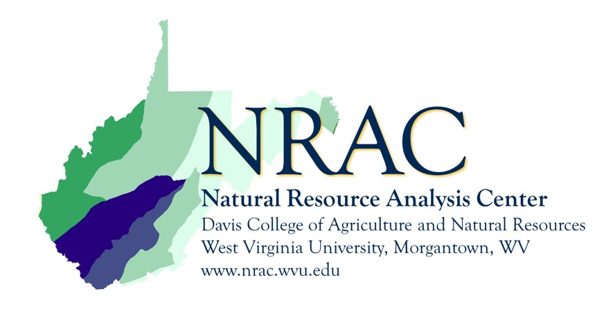

# TREE-D
Open-source UAS imagery dataset with detailed tree species annotations. Includes standardized protocols for RGB, multispectral and LiDAR data collection. Data integrity standards ensures consistent, public contributions for machine learning model development. MIT Licensed.

Product of the West Virginia University Natural Resource Analysis Center (NRAC)

Acknowledgements: 
Funding for this project has been provided through the Tree Research & Education Endowment Fund and the Utility Arborist Research Fund. 
Learn more at https://treefund.org/

    
    

